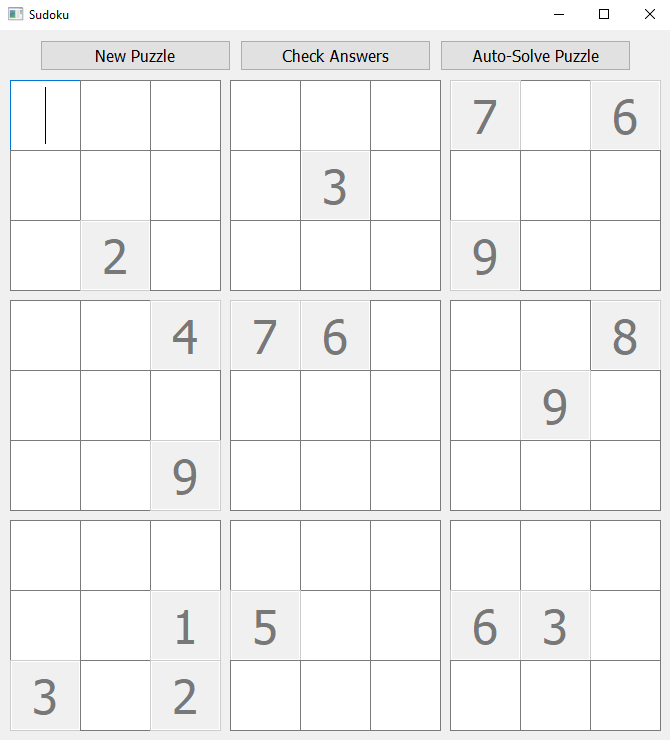
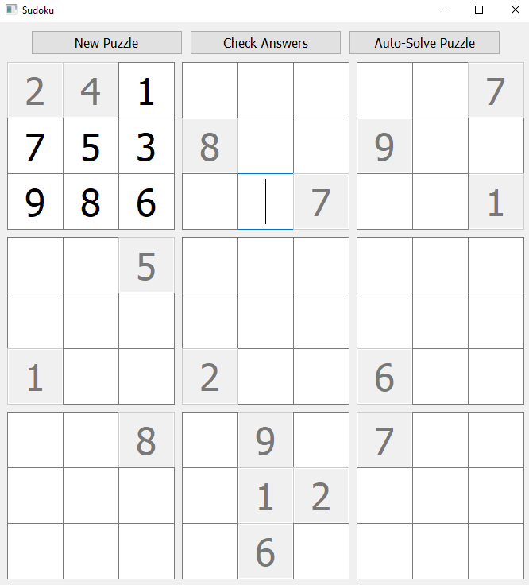
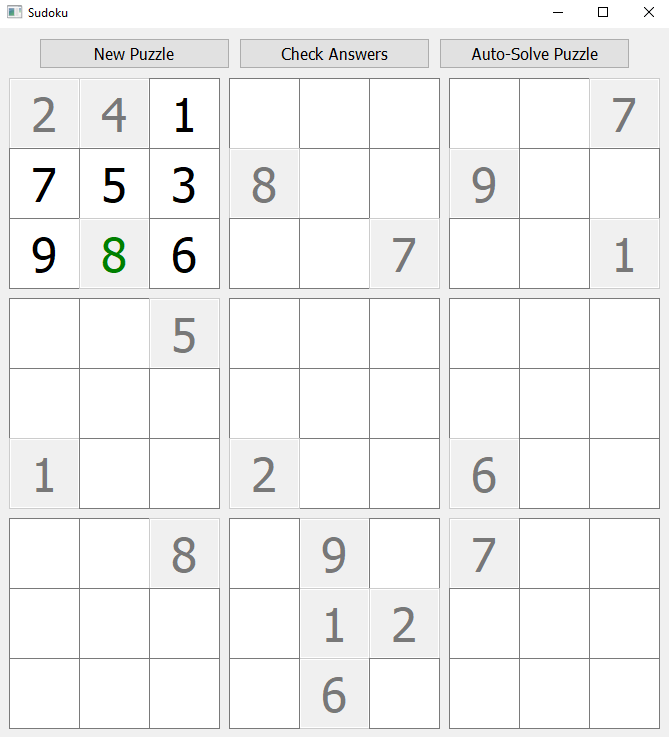
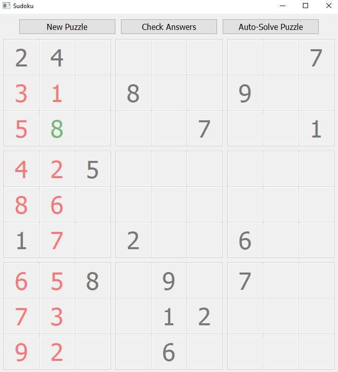
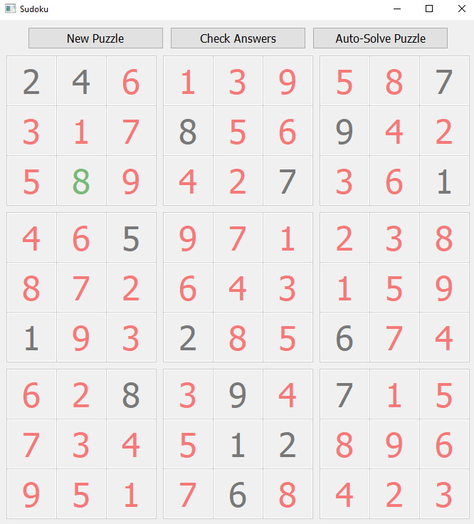

# Sudoku Solver
A basic Sudoku game with built in auto-solver.

## Dependancies
* Python 3.8.2
* PyQT5

## About

The Sudoku Solver game uses an algorithm to develop new random Sudoku puzzles. Once the puzzle is generated it allows the user to use mouse and keyboard to enter digits to attempt to fill out the puzzle. Once the player wants to check the answers the player can click the 'Check Answers' button. The program will then check all filled out answers and if it is correct it will lock in the answers and change the text color to green. If a player gives up the player can click the 'Auto-Solve Puzzle' button, the program will then use a backtracking algorithm to solve the Sudoku puzzle in real time allowing the player to watch how the algorithm works. As the puzzle is being auto-solved the puzzle will be locked and the auto-solved squares will have red text. A player can get a new puzzle at any point by simply clicking the 'New Puzzle' button.

## Gameplay

The game begins with a new blank puzzle.

The user can then enter their answers into the empty spaces using mouse and keyboard.

Once the user has entered some answers and wants to check them for correctness they may click the "Check Answers" button. If a answer is correct it will be locked in and the text will turn green. If the answers are incorrect they remain unchanged and allow the user to further adjust them.

When the user gives up and wants to see the completed puzzle they may click the "Auto-Solve Puzzle" button. At that point the backtracking algorithm will begin solving as the algorithm works the numbers will fill in to the completely locked board in red text.

As the backtracking algorithm finishes it allows for the user to click the "New Puzzle" button in order to gain a new puzzle to solve.

